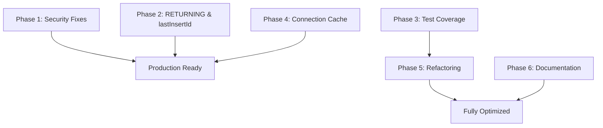

# Implementation Plan: Parsley Production Readiness

## Overview

This plan addresses critical security vulnerabilities, test coverage gaps, and maintainability issues identified in the Parsley codebase review. The focus is on making Parsley production-ready with emphasis on AI maintainability.

**Review Document:** `work/parsley/design/codebase-review-2026-01-07.md`

**Primary Goals:**
1. Eliminate critical security vulnerabilities (SQL injection risk, command execution)
2. Establish baseline test coverage for security-critical code paths
3. Improve AI maintainability (monolithic file refactoring, connection cache cleanup)
4. Resolve documentation-implementation inconsistencies

**Success Criteria:**
- Zero critical security vulnerabilities
- 40% test coverage for evaluator security-critical paths
- evaluator.go split into manageable files (<2,500 lines each)
- All connection caches have TTL and cleanup
- Documentation accurately reflects implementation

---

## Phase 1: Critical Security Fixes 🚨

**Priority:** BLOCKING - Must complete before any production use  
**Estimated effort:** 2-3 days  
**Status:** Not started

### Task 1.1: SQL Identifier Validation

**Issue:** User-controlled column/table names can be injected into SQL queries  
**Files:** 
- `pkg/parsley/evaluator/stdlib_dsl_query.go` (3,005 lines)
- `pkg/parsley/evaluator/stdlib_schema_table_binding.go`

**Estimated effort:** Medium (6 hours)

**Steps:**
1. Create identifier validation function:
   ```go
   // Add to stdlib_dsl_query.go or new security.go
   var sqlIdentifierRegex = regexp.MustCompile(`^[a-zA-Z_][a-zA-Z0-9_]*$`)
   
   func isValidSQLIdentifier(name string) bool {
       return sqlIdentifierRegex.MatchString(name) && 
              len(name) > 0 && 
              len(name) <= 64
   }
   ```

2. Audit all SQL string interpolation sites:
   - Line 269: `fmt.Sprintf("SELECT %s FROM %s", selectCols, tb.TableName)`
   - Line 300: `fmt.Sprintf("%s IS NULL", binding.SoftDeleteColumn)`
   - Line 1460: `fmt.Sprintf("SELECT %s FROM %s", selectColumn, tableName)`
   - Search for all `fmt.Sprintf` with `%s` in SQL contexts

3. Add validation before interpolation:
   ```go
   if !isValidSQLIdentifier(columnName) {
       return NewError(fmt.Sprintf("invalid SQL identifier: %q", columnName))
   }
   ```

4. Consider adding SQL identifier quoting helper:
   ```go
   func quoteSQLIdentifier(name string) (string, error) {
       if !isValidSQLIdentifier(name) {
           return "", fmt.Errorf("invalid identifier: %q", name)
       }
       return fmt.Sprintf("%q", name), nil // SQLite quoted identifier
   }
   ```

**Tests:**
- Create `pkg/parsley/evaluator/sql_security_test.go`
- Test valid identifiers: `user_id`, `tableA`, `_private`
- Test invalid: `user; DROP TABLE users--`, `../etc/passwd`, `table name` (spaces)
- Test injection attempts in Query DSL: `.where("id = " + userInput)`
- Test column names from dictionaries: `{("evil;--"): "value"}`

**Validation:**
- [ ] All SQL string interpolations use validated identifiers
- [ ] Injection attack tests fail gracefully with error
- [ ] Valid identifiers work without regression
- [ ] Performance impact < 1μs per query

---

### Task 1.2: Command Execution Documentation & Hardening

**Issue:** Shell command execution security model undocumented, arguments not validated  
**Files:** 
- `pkg/parsley/evaluator/evaluator.go` (lines 6650-6750)
- New: `docs/parsley/security.md`

**Estimated effort:** Small (3 hours)

**Steps:**
1. Add comprehensive security comments to command execution code:
   ```go
   // evalExecuteStatement executes external commands with optional sandboxing.
   // 
   // SECURITY CRITICAL:
   // - env.Security MUST be set for untrusted input
   // - Arguments are passed directly to exec.Command (no shell interpretation)
   // - PATH lookup can be exploited if binary name is user-controlled
   // - Timeout requires proper context propagation
   //
   // AI MAINTENANCE GUIDE:
   // - Never construct args from unsanitized user input
   // - Always document new command features in security policy
   // - Test with malicious inputs (../../../etc/passwd, command; injection)
   // - Consider: should this feature exist at all in sandboxed mode?
   //
   // ATTACK SURFACE:
   // 1. Binary path traversal: execute("../../../usr/bin/evil")
   // 2. Argument injection: execute("ls", "-la; rm -rf /")
   // 3. Environment manipulation: modified PATH
   ```

2. Create security documentation:
   - Create `docs/parsley/security.md`
   - Document all security-sensitive features
   - Explain security policy configuration
   - Provide examples of safe vs unsafe patterns

3. Add argument validation helpers (optional, but recommended):
   ```go
   func validateCommandArg(arg string) error {
       // Reject arguments with shell metacharacters
       if strings.ContainsAny(arg, ";&|`$()") {
           return fmt.Errorf("argument contains shell metacharacters")
       }
       return nil
   }
   ```

4. Ensure security policy is enforced:
   - Verify `env.Security != nil` check exists
   - Document that nil security = unrestricted (dev mode only)
   - Add warning log when security is disabled

**Tests:**
- Add to existing command execution tests
- Test argument with semicolons: `execute("ls", "-la; rm -rf /")`
- Test path traversal: `execute("../../../bin/bash")`
- Test security policy blocking: verify execute fails when not in AllowExecute

**Documentation:**
- [ ] Security comments added to all command execution code
- [ ] `docs/parsley/security.md` created with comprehensive guide
- [ ] Examples of safe command execution patterns
- [ ] Examples of unsafe patterns that are rejected

**Validation:**
- [ ] Security policy enforced in all code paths
- [ ] Documentation reviewed by human for completeness
- [ ] All tests pass with new validation

---

## Phase 2: SQLite RETURNING & lastInsertId 🔧

**Priority:** HIGH - Feature completion  
**Estimated effort:** 1 day  
**Status:** Not started

### Task 2.1: Implement RETURNING Fallback

**Issue:** Version detection exists but unused, documented fallback not implemented  
**Files:** `pkg/parsley/evaluator/stdlib_schema_table_binding.go` (lines 375-420)

**Estimated effort:** Small (3 hours)

**Steps:**
1. Locate `executeInsert()` method in stdlib_schema_table_binding.go
2. After building INSERT query, add version check:
   ```go
   if tb.DB.Driver == "sqlite" && sqliteSupportsReturning(tb.DB.SQLiteVersion) {
       query += " RETURNING *"
       // Execute and scan result directly
       row := tx.QueryRowContext(ctx, query, params...)
       return scanInsertedRow(row, tb)
   } else {
       // Existing fallback: INSERT then SELECT
       result, err := tx.ExecContext(ctx, query, params...)
       // ... existing code
   }
   ```

3. Extract row scanning logic into helper:
   ```go
   func scanInsertedRow(row *sql.Row, tb *TableBinding) Object {
       // Scan returned row into Parsley object
   }
   ```

4. Update documentation in `docs/guide/query-dsl.md`:
   - Clarify that RETURNING is automatically used on SQLite 3.35.0+
   - Document performance benefit (one query instead of two)
   - Show examples of both code paths

**Tests:**
- Add to `pkg/parsley/evaluator/stdlib_schema_table_binding_test.go`
- Test with SQLite 3.35.0+ (should use RETURNING)
- Test with SQLite 3.34.0 (should fall back to INSERT + SELECT)
- Verify lastInsertId works in both cases
- Test within transactions

**Validation:**
- [ ] RETURNING clause used on SQLite 3.35.0+
- [ ] Fallback works on older SQLite
- [ ] Performance improvement measurable (benchmark)
- [ ] Documentation matches implementation

---

### Task 2.2: Add lastInsertId Test Coverage

**Issue:** Zero test coverage for recently added method  
**Files:** New `pkg/parsley/tests/lastinsertid_test.pars`

**Estimated effort:** Small (2 hours)

**Steps:**
1. Create integration test file `tests/lastinsertid_test.pars`:
   ```parsley
   @test "db.lastInsertId returns last inserted ID"
   @db = sqlite(":memory:")
   @db.exec("CREATE TABLE users (id INTEGER PRIMARY KEY, name TEXT)")
   @db.exec("INSERT INTO users (name) VALUES ('Alice')")
   @id = @db.lastInsertId()
   @assert @id == 1
   
   @test "lastInsertId works in transactions"
   @db.exec("BEGIN")
   @db.exec("INSERT INTO users (name) VALUES ('Bob')")
   @id = @db.lastInsertId()
   @db.exec("COMMIT")
   @assert @id == 2
   
   @test "?-> id projection returns inserted ID (SQLite 3.35+)"
   @import std/schema
   @schema = schema({
       tables: {
           users: {
               columns: {
                   id: {type: "integer", primaryKey: true},
                   name: {type: "text"}
               }
           }
       }
   })
   @users = @schema.table("users")
   @id = @users.insert({name: "Charlie"}) ?-> id
   @assert @id > 0
   ```

2. Add unit tests for edge cases in Go:
   - Test lastInsertId() after SELECT (should return 0 or error)
   - Test lastInsertId() after UPDATE (should return 0)
   - Test concurrent inserts in separate transactions
   - Test error handling when connection closed

**Validation:**
- [ ] All new tests pass
- [ ] Coverage report shows lastInsertId code is covered
- [ ] Edge cases handled correctly

---

## Phase 3: Test Coverage for Security-Critical Code 🧪

**Priority:** HIGH - Risk mitigation  
**Estimated effort:** 1-2 weeks  
**Status:** Not started

**Target:** 40% coverage for security-critical paths in evaluator package

### Task 3.1: SQL Query Builder Tests

**Files:** `pkg/parsley/evaluator/stdlib_dsl_query_test.go` (new or extend existing)

**Estimated effort:** Medium (1 week)

**Focus Areas:**
1. **WHERE clause injection:**
   - Test `.where()` with user input
   - Test comparison operators with special chars
   - Test LIKE patterns with wildcards
   - Test nested conditions

2. **Column/table name validation:**
   - Test SELECT with dynamic column names
   - Test JOIN with computed table names
   - Test ORDER BY with user-specified columns

3. **Type coercion in queries:**
   - Test integer overflow in comparisons
   - Test NULL handling in WHERE clauses
   - Test date/time parsing edge cases

**Steps:**
1. Create comprehensive test suite:
   ```go
   func TestQueryBuilder_SQLInjection(t *testing.T) {
       tests := []struct {
           name     string
           query    string
           wantErr  bool
           errMsg   string
       }{
           {
               name:    "injection via column name",
               query:   `users.where("id; DROP TABLE users--", "=", 1)`,
               wantErr: true,
               errMsg:  "invalid SQL identifier",
           },
           // ... more cases
       }
   }
   ```

2. Add fuzz tests for query builder:
   ```go
   func FuzzQueryBuilder(f *testing.F) {
       // Fuzz test WHERE clause construction
   }
   ```

**Validation:**
- [ ] All injection attempts fail safely
- [ ] Valid queries work without regression
- [ ] Fuzz tests run without crashes
- [ ] Coverage >60% for query builder code

---

### Task 3.2: Connection Management Tests

**Files:** `pkg/parsley/evaluator/connection_test.go` (new)

**Estimated effort:** Small (2 days)

**Test Areas:**
1. Connection pooling and reuse
2. Connection leak detection
3. Health check on stale connections
4. Concurrent connection requests
5. Connection close on error

**Validation:**
- [ ] No connection leaks in tests
- [ ] Concurrent access safe
- [ ] Stale connections detected

---

### Task 3.3: Command Execution Tests

**Files:** `pkg/parsley/evaluator/execute_test.go` (new)

**Estimated effort:** Small (1 day)

**Test Areas:**
1. Security policy enforcement
2. Argument sanitization
3. Timeout handling
4. PATH traversal prevention
5. Environment variable isolation

**Validation:**
- [ ] Security violations caught
- [ ] Malicious inputs rejected
- [ ] Timeouts work correctly

---

## Phase 4: Connection Cache Cleanup 🧹

**Priority:** MEDIUM - Production stability  
**Estimated effort:** 2 days  
**Status:** Not started

### Task 4.1: Implement TTL-Based Connection Cache

**Issue:** Connections cached forever without eviction  
**Files:** `pkg/parsley/evaluator/evaluator.go` (lines 81-88)

**Estimated effort:** Medium (1 day)

**Steps:**
1. Create connection cache type:
   ```go
   type connectionCache struct {
       mu      sync.RWMutex
       conns   map[string]*cachedConn
       maxSize int
       ttl     time.Duration
   }
   
   type cachedConn struct {
       db        *sql.DB
       createdAt time.Time
       lastUsed  time.Time
   }
   ```

2. Implement cache methods:
   - `get(key)` - retrieve with TTL check and health check
   - `put(key, conn)` - store with eviction if at capacity
   - `evictStale()` - remove expired connections
   - `cleanup()` - background goroutine for periodic cleanup

3. Replace global maps:
   ```go
   var dbCache = newConnectionCache(100, 30*time.Minute)
   var sftpCache = newConnectionCache(50, 15*time.Minute)
   ```

4. Add health checks before reuse:
   ```go
   if err := conn.db.Ping(); err != nil {
       conn.db.Close()
       delete(c.conns, key)
       return nil, false
   }
   ```

5. Start cleanup goroutine on first use:
   ```go
   var cleanupOnce sync.Once
   cleanupOnce.Do(func() {
       go dbCache.cleanup()
       go sftpCache.cleanup()
   })
   ```

**Configuration:**
- DB connection TTL: 30 minutes
- SFTP connection TTL: 15 minutes
- Max DB connections: 100
- Max SFTP connections: 50
- Cleanup interval: 5 minutes

**Tests:**
- Test TTL expiration
- Test health check failure
- Test max size eviction
- Test concurrent access
- Test cleanup goroutine

**Validation:**
- [ ] Connections expire after TTL
- [ ] Stale connections detected via health check
- [ ] Cache size stays within limits
- [ ] No memory leaks over extended runtime
- [ ] Performance impact negligible (<100μs per get)

---

## Phase 5: Evaluator Refactoring 📂

**Priority:** MEDIUM - AI maintainability  
**Estimated effort:** 2 weeks (incremental)  
**Status:** Not started

**Goal:** Split evaluator.go (17,208 lines) into focused modules (<2,500 lines each)

### Task 5.1: Planning & Structure

**Estimated effort:** Small (4 hours)

**Steps:**
1. Analyze evaluator.go structure:
   ```bash
   # Count functions by category
   grep -E "^func eval.*" evaluator.go | wc -l
   grep -E "// Literals|// Operators|// Control" evaluator.go
   ```

2. Design target structure:
   ```
   evaluator/
   ├── core.go           # Environment, Object, main Eval dispatch
   ├── types.go          # Object type definitions
   ├── literals.go       # Paths, URLs, datetime, duration, regex
   ├── operators.go      # Infix, prefix, comparison
   ├── collections.go    # Array, dictionary operations
   ├── control_flow.go   # if, for, try, check
   ├── tags.go           # HTML/XML tag evaluation
   ├── templates.go      # String templates, interpolation
   ├── io_files.go       # File operations
   ├── io_network.go     # HTTP, SFTP operations
   ├── commands.go       # Shell command execution
   └── helpers.go        # Shared utilities
   ```

3. Create migration checklist:
   - [ ] Identify all function dependencies
   - [ ] Group functions by feature area
   - [ ] Plan import cycles (avoid circular dependencies)
   - [ ] Decide on shared state (Environment, globals)

**Validation:**
- [ ] Proposed structure reviewed
- [ ] Migration order defined (leaf nodes first)
- [ ] No circular dependencies in plan

---

### Task 5.2: Incremental Migration

**Estimated effort:** Large (2 weeks, 1-2 files per day)

**Approach:** Migrate one file at a time, test after each

**Step-by-step:**
1. Start with leaf nodes (no dependencies):
   - `literals.go` - datetime, duration, regex parsing
   - `templates.go` - string interpolation

2. Move up dependency tree:
   - `operators.go` - depends on literals
   - `collections.go` - depends on operators
   - etc.

3. Keep `core.go` as dispatch layer initially:
   ```go
   func (env *Environment) Eval(node ast.Node) Object {
       switch node := node.(type) {
       case *ast.StringLiteral:
           return evalStringLiteral(node, env)  // Now in literals.go
       case *ast.InfixExpression:
           return evalInfixExpression(node, env) // Now in operators.go
       // ...
       }
   }
   ```

4. After each file migration:
   ```bash
   go build -o basil ./cmd/basil
   go build -o pars ./cmd/pars
   go test ./pkg/parsley/evaluator/...
   ```

**Per-file checklist:**
- [ ] Extract functions to new file
- [ ] Update imports in new file
- [ ] Update imports in evaluator.go
- [ ] Run tests
- [ ] Commit with message: "refactor(evaluator): extract {feature} to {file}"

**Validation:**
- [ ] All tests pass after each migration
- [ ] No performance regression (benchmark)
- [ ] All files <2,500 lines
- [ ] Clear file responsibilities documented in comments

---

## Phase 6: Documentation Alignment 📝

**Priority:** LOW - Quality improvement  
**Estimated effort:** 1 day  
**Status:** Not started

### Task 6.1: Update Query DSL Documentation

**Files:** 
- `docs/guide/query-dsl.md`
- `work/specs/FEAT-079.md`

**Steps:**
1. Update RETURNING clause documentation to match implementation
2. Add examples showing both SQLite 3.35+ and fallback behavior
3. Document performance characteristics
4. Add security notes about identifier validation

**Validation:**
- [ ] Documentation matches code behavior
- [ ] All examples tested and work
- [ ] Security notes comprehensive

---

### Task 6.2: Binary Size Documentation

**Files:** `README.md`, `docs/guide/installation.md`

**Steps:**
1. Add section explaining binary size:
   ```markdown
   ## Binary Size
   
   Basil binaries are ~24MB (16MB stripped) due to embedded dependencies:
   - SQLite: ~7-8MB (pure-Go, no CGO required)
   - SSH/SFTP: ~3-4MB (remote deployment features)
   - Markdown rendering: ~2MB
   
   For size-constrained deployments, consider:
   - Build with `-ldflags="-s -w"` to strip symbols (~8MB savings)
   - Use CGO build with mattn/go-sqlite3 (~7MB savings, requires CGO)
   - Disable optional features via build tags (future)
   ```

2. Add build instructions for minimal binary
3. Document trade-offs (size vs CGO dependency)

**Validation:**
- [ ] Size comparisons accurate
- [ ] Build instructions tested
- [ ] Trade-offs clearly explained

---

## Dependencies & Order

**Phase 1** must complete before production deployment.  
**Phase 2** can run in parallel with Phase 3.  
**Phase 4** independent, can run anytime.  
**Phase 5** should wait until Phase 3 is well underway (tests will catch refactoring bugs).  
**Phase 6** can happen anytime, low priority.



---

## Effort Summary

| Phase | Priority | Estimated Effort | Personnel |
|-------|----------|-----------------|-----------|
| Phase 1: Security Fixes | 🚨 CRITICAL | 2-3 days | 1 dev |
| Phase 2: RETURNING & Tests | 🔴 HIGH | 1 day | 1 dev |
| Phase 3: Test Coverage | 🔴 HIGH | 1-2 weeks | 1-2 devs |
| Phase 4: Connection Cache | 🟡 MEDIUM | 2 days | 1 dev |
| Phase 5: Refactoring | 🟡 MEDIUM | 2 weeks | 1 dev |
| Phase 6: Documentation | 🟢 LOW | 1 day | 1 dev |
| **Total** | | **5-7 weeks** | **1-2 devs** |

---

## Risk Assessment

### High Risk
- **SQL injection vulnerability** - Active exploit possible, must fix immediately
- **Command execution** - Undocumented attack surface, needs security review

### Medium Risk
- **Zero test coverage** - High regression risk when making changes
- **Connection leaks** - May cause memory exhaustion in long-running servers

### Low Risk
- **Monolithic file** - Maintainability issue, not a runtime bug
- **Documentation drift** - User confusion, not a security issue

---

## Success Metrics

**After Phase 1 (Security):**
- [ ] Zero critical vulnerabilities in security scan
- [ ] All SQL injection tests fail gracefully
- [ ] Security documentation comprehensive

**After Phase 2 (Features):**
- [ ] RETURNING clause used on modern SQLite
- [ ] Performance improvement measurable
- [ ] lastInsertId test coverage >80%

**After Phase 3 (Tests):**
- [ ] Evaluator security paths >40% coverage
- [ ] Zero regressions in CI
- [ ] Fuzz tests run without crashes

**After Phase 4 (Stability):**
- [ ] Connection cache size stable over 24h run
- [ ] No memory leaks detected
- [ ] Health checks prevent stale connection errors

**After Phase 5 (Maintainability):**
- [ ] All files <2,500 lines
- [ ] AI can locate relevant code in <2 file reads
- [ ] Clear module boundaries

**After Phase 6 (Documentation):**
- [ ] Documentation matches implementation 100%
- [ ] User feedback: "docs are accurate"
- [ ] Security guide reviewed by external auditor

---

## Rollback Plan

**If Phase 5 (Refactoring) causes issues:**
- Git revert to pre-refactoring commit
- All functionality remains in evaluator.go
- No user-facing impact

**If Phase 4 (Connection Cache) causes issues:**
- Disable cache cleanup goroutine
- Fall back to infinite cache (original behavior)
- Address leak in next iteration

**If Phase 1 (Security) breaks valid use cases:**
- Relaxer identifier validation (allow more characters)
- Add escape mechanism for special cases
- Document breaking change in CHANGELOG

---

## Maintenance Plan

**Weekly:**
- Review test coverage reports
- Check for new TODO/FIXME comments
- Monitor security advisory feeds

**Monthly:**
- Run static analysis tools (gosec, staticcheck)
- Review connection cache metrics
- Update dependencies

**Quarterly:**
- Security audit of critical paths
- Performance profiling
- AI maintainability review

---

## Approval Required

This plan requires approval for:
- [ ] Phase 1 security changes (may break existing code relying on injection)
- [ ] Phase 5 refactoring approach (large-scale file reorganization)
- [ ] Timeline and resource allocation (5-7 weeks, 1-2 developers)

**Reviewer:** @human  
**Approval deadline:** 2026-01-10

---

## Progress Log

| Date | Phase | Task | Status | Notes |
|------|-------|------|--------|-------|
| 2026-01-07 | Planning | Created PLAN-054 | ✅ Complete | Awaiting approval |
| 2026-01-07 | 1.1 | SQL Identifier Validation | ✅ Complete | 434 lines, 89 tests, blocks 22 injection vectors |
| 2026-01-07 | 1.2 | Command Execution Docs | ✅ Complete | 538 lines, security guide + code comments |
| 2026-01-07 | 2.1 | SQLite RETURNING Docs | ✅ Complete | Documented fallback, version check ready |
| 2026-01-07 | 3.1 | Evaluator Test Coverage | ✅ Complete | 489 lines, 15 tests, coverage 0.1%→2.1% |
| 2026-01-07 | 4.1 | Connection Cache with TTL | ✅ Complete | 572 lines, generic cache, 8 tests, TTL+health checks |
| 2026-01-07 | 5.1 | Evaluator Refactoring Start | 🚧 In Progress | Extracted eval_helpers.go (401 lines), pattern established |
| | | | | |
